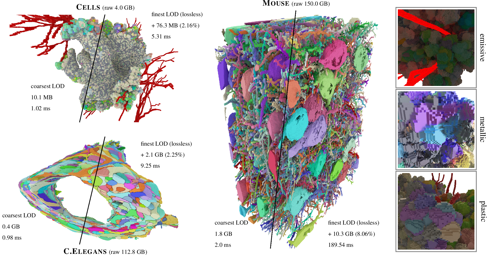
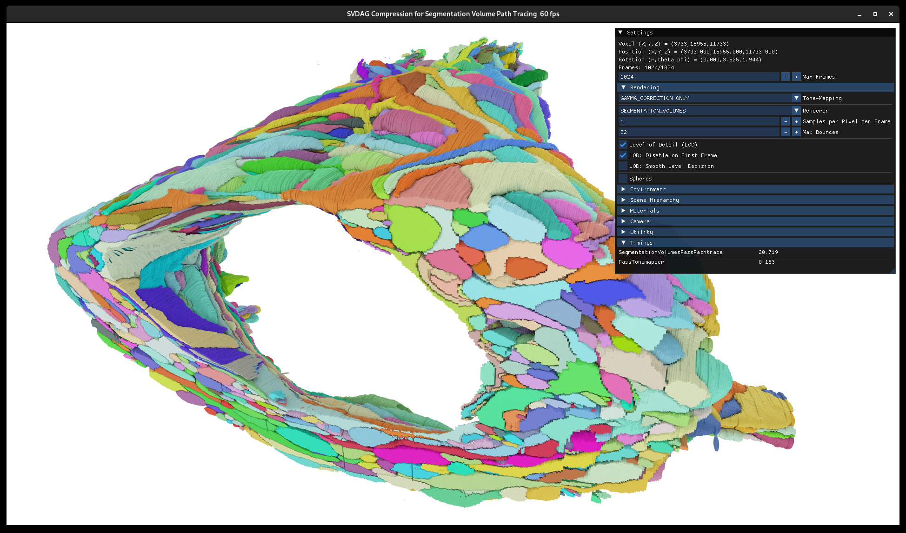

# SVDAG Compression for Segmentation Volume Path Tracing


## Introduction
This repository contains the source code for the VMV 2024 paper:

> [**SVDAG Compression for Segmentation Volume Path Tracing**](...)<br>
> [Mirco Werner](https://github.com/MircoWerner)<sup>&dagger;</sup>, [Max Piochowiak](https://cg.ivd.kit.edu/piochowiak/staff_index.php)<sup>&dagger;</sup>, and [Carsten Dachsbacher](https://cg.ivd.kit.edu/dachsbacher/staff_index.php) <br>
> &dagger; joint first authors

> *Abstract* Many visualization techniques exist for interactive exploration of segmentation volumes, however, photorealistic renderings are usually computed using slow offline techniques. We present a novel compression technique for segmentation volumes which enables interactive path tracing-based visualization for datasets up to hundreds of gigabytes: For every label, we create a grid of fixed-size axis aligned bounding boxes (AABBs) which covers the occupied voxels. For each AABB we first construct a sparse voxel octree (SVO) representing the contained voxels of the respective label, and then build a sparse voxel directed acyclic graph (SVDAG) identifying identical sub-trees across all SVOs; the lowest tree levels are stored as an occupancy bit-field. As a last step, we build a bounding volume hierarchy for the AABBs as a spatial indexing structure. Our representation solves a compression rate limitation of related SVDAG works as labels only need to be stored along with each AABB and not in the graph encoding of their shape. Our compression is GPU-friendly as hardware raytracing efficiently finds AABB intersections which we then traverse using a custom accelerated SVDAG traversal. Our method is able to path-trace a 113 GB volume on a consumer-grade GPU with 1 sample per pixel with up to 32 bounces at 108 FPS in a lossless representation, or at up to 1017 FPS when using dynamic level of detail.

## Structure of the Repository
[`SegmentationVolumes/resources/shaders/trace`](./SegmentationVolumes/resources/shaders/trace) contains the GLSL shaders to traverse our proposed data structure.
- custom traversal of SVDAG and occupancy field inside an AABB: [`svdag_occupancy_field`](./SegmentationVolumes/resources/shaders/trace/svdag_occupancy_field.glsl)
  - called by [`intersect`](./SegmentationVolumes/resources/shaders/trace/intersect.glsl) when an intersection with an AABB is found during the hardware-accelerated BVH traversal

Other files worth mentioning:
- main and rendering logic: [`main`](./SegmentationVolumes/src/bin/main.cpp), [`SegmentationVolumes`](./SegmentationVolumes/include/segmentationvolumes/SegmentationVolumes.h)
- converter that builds our compressed format (data structure) from the raw data: [`SegmentationVolumeConverter`](./SegmentationVolumes/include/segmentationvolumes/converter/SegmentationVolumeConverter.h)
  - SVO builder: [`Octree`](./SegmentationVolumes/include/segmentationvolumes/converter/builder/Octree.h)
  - SVDAG builder: [`DAG`](./SegmentationVolumes/include/segmentationvolumes/converter/builder/DAG.h)
  - SVDAG builder (GPU variant): [`DAGGPU`](./SegmentationVolumes/include/segmentationvolumes/converter/builder/DAGGPU.h) and passes in [`SegmentationVolumes/resources/shaders/builder`](./SegmentationVolumes/resources/shaders/builder)

## Requirements
- Vulkan 1.3
- GPU with ray tracing support
- OpenMP
- [TBB](https://github.com/oneapi-src/oneTBB)

Other dependencies are included as submodules in [`SegmentationVolumes/lib/`](./SegmentationVolumes/lib) and [`VkRaven/lib/`](./VkRaven/lib).

## Running the Code
Tested on Linux with GCC 14.1.1 and NVIDIA RTX 3070 GPU and NVIDIA RTX 4070 Ti SUPER.

Windows is not officially supported, however, we get it to run using MinGW.

### Quick Setup (clone, download test dataset, build, convert test dataset, run)
```bash
# clone
git clone --recursive git@github.com:MircoWerner/SegmentationVolumeCompression.git
cd SegmentationVolumeCompression
# download test dataset
mkdir -p data/mouse
cd data/mouse
curl https://l4dense2019.brain.mpg.de/webdav/dendrites.hdf5 --output dendrites.hdf5
curl https://l4dense2019.brain.mpg.de/webdav/mapped-segmentation-volume/x0y0z0.hdf5 --output x0y0z0.hdf5 # you can download as many volume parts from the mouse cortex as you wish
cd ../..
# build
cd SegmentationVolumes
mkdir build
cd build
cmake -DCMAKE_BUILD_TYPE=Release ..
make
# convert test dataset
./segmentationvolumes ../../data mouse --convert # this will take a while
# run
./segmentationvolumes ../../data mouse
```

### Custom Datasets
#### Prepare
- Create a data folder. Inside, create a folder for the dataset (e.g., mouse) and place the raw data files in it.
- Write a converter similar to [`MouseConverter`](./SegmentationVolumes/include/segmentationvolumes/converter/MouseConverter.h) to extract non-empty voxels and labels from the raw data files.
- Add the converter to the [`main`](./SegmentationVolumes/src/bin/main.cpp) file.
- Write a scene/dataset file similar to [`mouse`](./SegmentationVolumes/resources/scenes/mouse.xml).
#### Convert
```bash
./segmentationvolumes /path/to/data yourdatasetname --convert
```
#### Run
```bash
./segmentationvolumes /path/to/data yourdatasetname
```
```
Usage: segmentationvolumes [--help] [--version] [--rayquery] [--evaluate] [--convert] data scene

Positional arguments:
  data           path to the data folder (e.g. /path/to/data/) [required]
  scene          name of the scene (in resources/scenes/<name>.xml) [required]

Optional arguments:
  -h, --help     shows help message and exits 
  -v, --version  prints version information and exits 
  --rayquery     use ray query in compute shader instead of ray tracing pipeline 
  --evaluate     perform evaluation on given scene (measure rendering performance and store rendered image) 
  --convert      perform conversion from raw data to compressed format 
```

### Controls
- `WASD` to move the camera
- `Space` or `E` to move the camera up
- `Shift` or `Q` to move the camera down
- Hold `Ctrl` to move faster
- Hold `Right Mouse Button` to look around
- `Esc` to close the application

## Acknowledgements
We would like to thank the creators and authors of the used datasets and libraries:
- Cells: ROSENBAUER, J., BERGHOFF, M., and SCHUG, A. “Emerging Tumor Development by Simulating Single-cell Events”. bioRxiv (2020). DOI: 10.1101/2020.08.24.264150
- C.Elegans: WITVLIET, D., MULCAHY, B., MITCHELL, J. K., et al. “Connectomes across development reveal principles of brain maturation”. Nature 596.7871 (2021), 257–261. DOI: 10.1038/s41586-021-03778-8
- Mouse: MOTTA, A., BERNING, M., BOERGENS, K. M., et al. “Dense connectomic reconstruction in layer 4 of the somatosensory cortex”. Science 366.6469 (2019), eaay3134. DOI: 10.1126/science.aay3134
- [argsparse](https://github.com/p-ranav/argparse), [glfw](https://github.com/glfw/glfw), [glm](https://github.com/g-truc/glm), [imgui](https://github.com/ocornut/imgui), [pugixml](https://github.com/zeux/pugixml), [SPIRV-Reflect](https://github.com/KhronosGroup/SPIRV-Reflect), [stb](https://github.com/nothings/stb), [tinygltf](https://github.com/syoyo/tinygltf), [tinyobjloader](https://github.com/tinyobjloader/tinyobjloader), and [HighFive](https://github.com/BlueBrain/HighFive).

